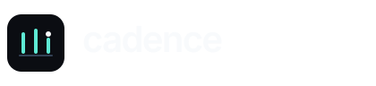
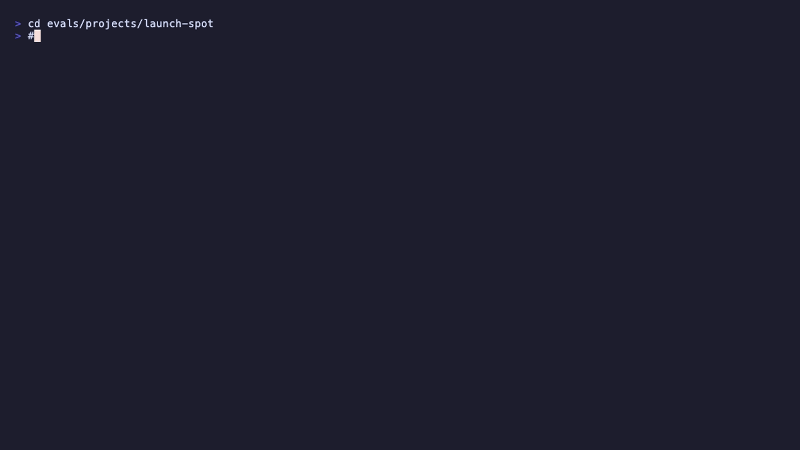
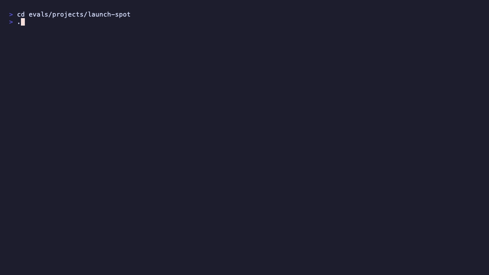

# Cadence

<p align="center">
  
</p>

<p align="center">
  <strong>Programmatic video from Lua.</strong> No browser. No React scaffold.<br/>
  One <code>.lua</code> file → headless LÖVE → ffmpeg → mp4.
</p>

<p align="center">
  <a href="https://github.com/shinyobjectz/cadence">GitHub</a> ·
  <a href="CHECKS.md">Verification</a> ·
  <a href="skills/cadence/SKILL.md">Agent skill</a> ·
  <code>npx skills add shinyobjectz/cadence</code>
</p>

---

Cadence is a seek-not-playback motion framework: compositions are pure functions of time. Agents author `.lua` files; the renderer evaluates any frame in any order; verification runs in milliseconds before you ever encode.

## Quick start

```bash
git clone https://github.com/shinyobjectz/cadence.git && cd cadence
cd desktop && pnpm install && cd ..

# environment check
bin/cadence doctor

# instant compile (wasmoon, ~30ms)
cd evals/projects/launch-spot
../../bin/cadence verify comps/launch.lua --wasm-only

# render
../../bin/cadence render comps/launch.lua -o out.mp4
```

Install the agent skill (Cursor, Claude Code, Codex, Copilot, …):

```bash
npx skills add shinyobjectz/cadence
```

## CLI

| Command | What it does |
|---------|----------------|
| `cadence verify comp.lua --json` | Compile → lint → check pipeline |
| `cadence verify … --wasm-only` | Instant tier-0 compile feedback |
| `cadence doctor` | Probe love, ffmpeg, wasmoon, project layout |
| `cadence feedback comp.lua` | Agent-readable summary + next steps |
| `cadence lint / check` | Static + pixel verification (`--json`) |
| `cadence render` | Offline encode to mp4 |

All verification commands emit **`cadence.result/v1`** JSON — structured findings agents can parse without reading stack traces.

## Terminal

<p align="center">
  
</p>

<p align="center">
  
</p>

<p align="center">
  
</p>

## Composition sketch

```lua
local e = require("cadence")

return e.comp {
  width = 1080, height = 1920, duration = 6, fps = 30,
  background = "#0B0D12",

  scene = function(s)
    local title = s:text { x = 540, y = 960, text = "cadence", size = 120,
                           color = "#5EEAD4", anchor = "center", opacity = 0 }
    s:script(function(t)
      t:tween(title, 0.8, { opacity = 1, size = 140 }, "backOut")
    end)
  end,
}
```

## Why Cadence

- **Deterministic by construction** — no clocks, no I/O in comps; RNG seeded
- **Agent-first** — lint/check/verify JSON, skill on [skills.sh](https://skills.sh)
- **~10MB engine** — vendored LÖVE fork, not headless Chrome
- **Three hosts, one API** — native encode, wasmoon preview, Rust helpers

## Renderer

`CADENCE_SCENE=1` paints the frame through `cadence-scene` (vello_cpu + parley):
one rasterizer for text, shapes, images, html, vector, masks, blends and
shadows, with no GPU readback when a comp is fully scene-owned. Kinds not ported
yet fall back to love per node. Details, coverage and measurements:
[docs/SCENE.md](docs/SCENE.md). `bin/golden capture|compare` holds per-frame
hashes across renderer changes.

## Layout

| Path | Purpose |
|------|---------|
| `bin/cadence` | CLI entry (render, verify, doctor, …) |
| `lib/cadence/` | Host-free authoring API |
| `runtime/` | LÖVE offline host (`scene.lua` = bridge to the rasterizer) |
| `scene/` | `cadence-scene`: the vello_cpu + parley rasterizer |
| `desktop/` | Tauri + React editor (optional) |
| `skills/cadence/` | Official agent skill |
| `evals/` | Public visual suite |

## Ellua → Cadence

This project was formerly **ellua**. The Lua module alias `require("ellua")` remains for compatibility; new work should use `cadence` naming. The archived repo: [github.com/shinyobjectz/ellua](https://github.com/shinyobjectz/ellua).

## License

MIT — see [LICENSE](LICENSE) if present, otherwise check repo root.
